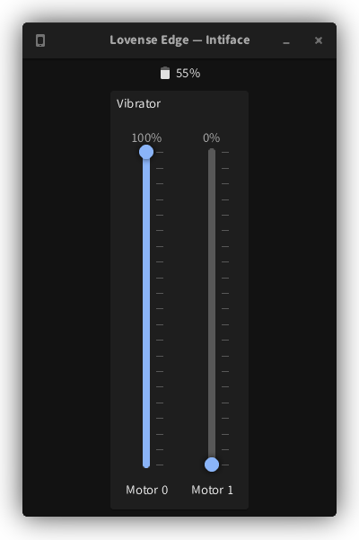

<h1 align="center">intiface-gtk</h1>
<p align="center">

</p>

[Intiface][intiface]/[buttplug.io][buttplug.io] frontend in GTK4.

[intiface]:    https://github.com/intiface/intiface-cli-rs
[buttplug.io]: https://buttplug-spec.docs.buttplug.io/

## Building

For dependencies, see [.nix/pkgs.nix](./nix/pkgs.nix).

```sh
go build -v
```
